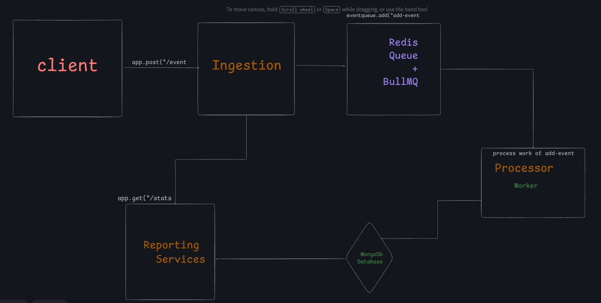

# 📈 High-Performance Website Analytics Backend Service

A scalable and robust backend system built with Node.js, TypeScript, BullMQ, Redis, and MongoDB, designed to reliably capture and analyze high volumes of website analytics events.

## 🏗️ Architecture Overview

The system employs a decoupled, three-service architecture to maximize ingestion speed and ensure reliable processing.



---

## 🎯 Architecture Decision: Asynchronous Processing (BullMQ & Redis)

### How It's Implemented: The Queue

The asynchronous processing is the core feature that enables high throughput. It is implemented using **BullMQ** (a feature-rich job queue library) backed by **Redis** (the high-speed, persistent message broker).

The **Ingestion API** validates the event and immediately adds it as a job to the BullMQ queue, returning a **200 OK** response instantly. The **Processor Worker** runs in the background, consuming jobs from the queue, processing the data, and performing the persistent write to MongoDB.

### Why This Design?

| Benefit | Explanation |
| :--- | :--- |
| **Decoupling** | Separates the fast API endpoint from slow database I/O, preventing write bottlenecks. |
| **Speed & Throughput** | Redis provides sub-millisecond queueing, allowing the Ingestion API to handle maximum requests per second. |
| **Reliability** | BullMQ manages job persistence, retry mechanisms, and dead-letter queues, ensuring no event is lost due to temporary failures. |
| **Scalability** | The system is horizontally scalable: multiple Processor Workers can be added to handle peak load. |

---

## 📊 Database Schema (MongoDB)

All raw event data is stored in the **`events`** collection in MongoDB. The schema is flexible to adapt to changing event structures.

```javascript
Collection: events
{
  _id: ObjectId,           // Unique MongoDB identifier
  site_id: String,         // REQUIRED: Website identifier (e.g., "site-abc-123")
  event_type: String,      // REQUIRED: Type of event (e.g., "page_view", "button_click")
  path: String,            // URL path visited (e.g., "/pricing")
  user_id: String,         // Unique user identifier
  timestamp: Date,         // Event timestamp provided by the client (ISO 8601)
  created_at: Date         // Record creation time (set by the processor)
}

🚀 Setup Instructions

Follow these steps to set up and run all three services.

Prerequisites

Node.js (v18 or higher)
Docker Desktop (for Redis)
MongoDB (local instance or Atlas connection string)
pnpm (package manager)
Step 1: Clone and Install Bashgit clone https://github.com/xVIKASINGH/Internship_Assignment.git

cd Internship_Assessment

pnpm install

pnpm run build


Step 2: Configure Environment Variables

Create a file named .env in the root directory:Code snippet# MongoDB Configuration

MONGODB_URI=mongodb://localhost:27017/analytics 

# Redis Configuration (Used by BullMQ)
REDIS_HOST=localhost
REDIS_PORT=6379

# Service Ports
INGESTION_PORT=3000
REPORTING_PORT=3001

Step 3: Start Redis (Docker)

Start the Redis container which will host the BullMQ 
queue:Bashdocker run -d --name redis-analytics -p 6379:6379 redis:alpine


Step 4: Start All Services 

Open three separate terminal windows and run the following commands to start the API and
 background worker
pnpm start:ingestion          -> Ingestion API running on port 3000
pnpm start:reporting          -> Reporting API running on port 5000
pnpm start:processor          -> Worker started and waiting for jobs...


curl command to test:

  -H "Content-Type: application/json" \
  -d '{
    "site_id": "site-abc-123",
    "event_type": "page_view",
    "path": "/pricing",
    "user_id": "user-unique-001",
    "timestamp": "2025-11-14T15:00:00Z"
  }'


# Success Response: {"success": true, "message": "Event queued successfully"}


2. Get Analytics (GET /stats)

Queries the Reporting API for aggregated analytics.
This uses MongoDB Aggregation Framework for efficient calculations.

Endpoint:

http://localhost:3001/stats

📅 Get Stats for a Specific Day

Bash:

curl "http://localhost:3001/stats?site_id=site-abc-123&date=2025-11-14"

📊 Get All-Time Stats (No date param)

Bash:

curl "http://localhost:3001/stats?site_id=site-abc-123"

✅ Success Response Example

JSON:

{
  "site_id": "site-abc-123",
  "date": "2025-11-14",
  "total_views": 1050,
  "unique_users": 150,
  "top_paths": [
    { "path": "/pricing", "views": 700 },
    { "path": "/blog", "views": 250 }
  ]
}

